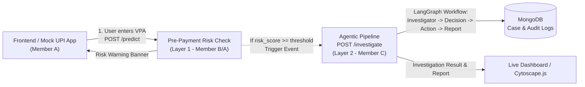

# FraudGuard AI — API Specification Contract

**System**: FraudGuard AI (Autonomous UPI Transaction Fraud Detection and Case Resolution)  
**Academic Year**: 2026–2027 | **Project Group**: 10  
**Authors**: Shruti Jaggi (Member C), Kosada Bhat (Member B), Ananya Rajankar (Member A)  
**Base URL (Agent/ML Service)**: `http://127.0.0.1:8001`  
**Swagger UI**: `http://127.0.0.1:8001/docs`

---

## 1. Architecture Flow



---

## 2. Layer 1 Contract: `POST /predict`

### Purpose
Provides an instant, sub-second pre-payment risk evaluation when a user inputs or selects a receiver VPA on the **Send Money** screen, before transaction authorization.

### Endpoint
- **Method**: `POST`
- **Path**: `/predict`
- **Content-Type**: `application/json`

### Request Specification
```json
{
  "sender_account_id": "acc_user_101",
  "receiver_vpa": "mule.relay99@oksbi",
  "amount": 49000.00,
  "device_id": "DEV_USER_PHONE_01"
}
```

#### Field Details:
| Field Name | Type | Required / Optional | Description | Example |
| :--- | :--- | :--- | :--- | :--- |
| `sender_account_id` | `string` | **Required** | The account ID of the paying user. | `"acc_user_101"` |
| `receiver_vpa` | `string` | **Required** | Target Virtual Payment Address (UPI ID) entered by user. | `"mule.relay99@oksbi"` |
| `amount` | `number (float)` | **Required** | Transfer amount in INR. | `49000.00` |
| `device_id` | `string` | Optional | Device identifier of the payer for anomaly cross-checks. | `"DEV_USER_PHONE_01"` |

### Response Specification
```json
{
  "receiver_vpa": "mule.relay99@oksbi",
  "receiver_account_id": "acc_mule_chain_01",
  "risk_score": 0.95,
  "risk_level": "CRITICAL",
  "is_flagged": true,
  "warning_message": "CRITICAL RISK: This receiver UPI ID was flagged in a mule-chain fraud ring. Payments to this account are restricted.",
  "trigger_investigation": true
}
```

#### Field Details:
| Field Name | Type | Required / Optional | Description | Example |
| :--- | :--- | :--- | :--- | :--- |
| `receiver_vpa` | `string` | **Required** | The evaluated receiver VPA. | `"mule.relay99@oksbi"` |
| `receiver_account_id` | `string` | **Required** | Internal account identifier resolved for receiver. | `"acc_mule_chain_01"` |
| `risk_score` | `number (float)` | **Required** | Fraud probability score normalized between `0.0` and `1.0`. | `0.95` |
| `risk_level` | `string (enum)` | **Required** | Categorical risk bracket: `"LOW"`, `"MEDIUM"`, `"HIGH"`, `"CRITICAL"`. | `"CRITICAL"` |
| `is_flagged` | `boolean` | **Required** | `true` if risk score exceeds warning threshold (e.g. $\ge 0.50$). | `true` |
| `warning_message` | `string` | **Required** | Human-readable warning banner text for mock UPI frontend. | `"CRITICAL RISK: ..."` |
| `trigger_investigation`| `boolean` | **Required** | Signals whether backend must trigger Layer 2 `/investigate`. | `true` |

---

## 3. Layer 2 Contract: `POST /investigate`

### Purpose
Triggers the autonomous 4-agent LangGraph pipeline (`Investigator -> Decision -> Action -> Report`) using a local LLM (Ollama / `llama3.2:latest`) to analyze multi-hop graph topology, issue mitigations, and compile a case audit report.

### Endpoint
- **Method**: `POST`
- **Path**: `/investigate`
- **Query Param**: `use_cache=true|false` (Optional: instant pre-cached response for live demo presentation reliability)
- **Content-Type**: `application/json`

### Request Specification
```json
{
  "account_id": "acc_mule_chain_01"
}
```

*(Note: An optional `account_data` object can also be supplied if direct payload testing is needed without database lookup).*

#### Field Details:
| Field Name | Type | Required / Optional | Description | Example |
| :--- | :--- | :--- | :--- | :--- |
| `account_id` | `string` | **Required** | Unique account ID flagged for deep forensic investigation. | `"acc_mule_chain_01"` |
| `account_data` | `object` | Optional | Optional in-memory override of account/graph profile. | `null` |

### Response Specification
```json
{
  "account_id": "acc_mule_chain_01",
  "decision": "auto_block",
  "action_taken": "UPI ID 'mule.relay99@oksbi' revoked; Immediate debit freeze applied on NPCI switch; Device 'DEV_ANDROID_9921_MULE' blacklisted across inter-bank fraud registry.",
  "report": "=== FRAUDGUARD AI CASE AUDIT REPORT ===\nTarget Account : acc_mule_chain_01 (mule.relay99@oksbi)\nAccount Age    : 4 days | KYC Status: PARTIAL_MINIMUM_OTP\nRisk Level     : HIGH (Score: 95/100)\n\n[Investigation Summary]\nThis account exhibits characteristics of a mule-chain layering scheme, with rapid pass-through of funds from multiple source accounts to an aggregator with near-zero retained balance in new accounts.\n\n[Identified Risk Factors]\n  - Rapid pass-through of funds from multiple source accounts to an aggregator with near-zero retained balance in new accounts\n  - High transaction frequency per day\n  - Multiple inflows from victim accounts with high volume\n  - Outflow to high-risk sink\n  - Shared device with mule cluster\n\n[Enforcement Directive]\nDecision     : AUTO_BLOCK\nAction Taken : UPI ID 'mule.relay99@oksbi' revoked; Immediate debit freeze applied on NPCI switch; Device 'DEV_ANDROID_9921_MULE' blacklisted across inter-bank fraud registry.\n========================================"
}
```

#### Field Details:
| Field Name | Type | Required / Optional | Description | Values / Example |
| :--- | :--- | :--- | :--- | :--- |
| `account_id` | `string` | **Required** | Target account investigated. | `"acc_mule_chain_01"` |
| `decision` | `string (enum)` | **Required** | Autonomous policy verdict. | `"auto_block"` \| `"escalate"` \| `"clear"` |
| `action_taken` | `string` | **Required** | Concrete simulated mitigation executed by Action Agent. | `"UPI ID revoked; Debit freeze applied..."` |
| `report` | `string` | **Required** | Forensic case report generated by Report Agent. | `"=== FRAUDGUARD AI CASE AUDIT REPORT ===..."` |

---

## 4. Helper / Telemetry Endpoints

### `GET /health`
- Returns service status and connected Ollama LLM model info.

### `GET /accounts`
- Returns list of available mock accounts (`acc_mule_chain_01`, `acc_star_burst_02`, `acc_suspicious_device_04`, `acc_legit_retail_03`) for easy UI testing and presentation.
