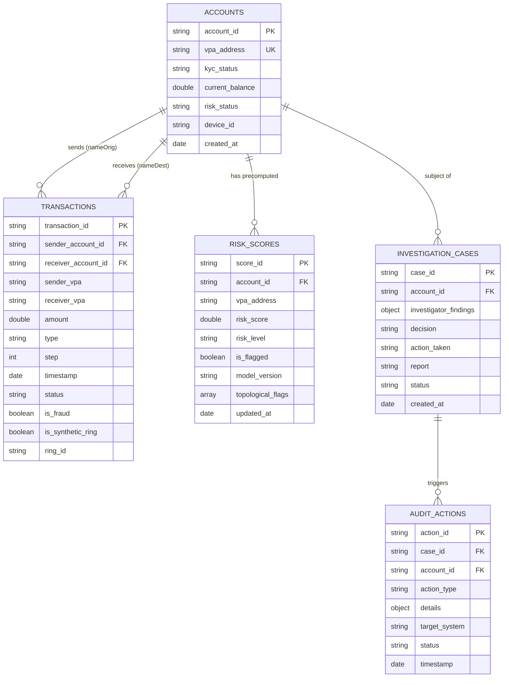

# FraudGuard AI — MongoDB Database Schema

**System**: FraudGuard AI (Autonomous UPI Transaction Fraud Detection and Case Resolution)  
**Database Name**: `fraudguard_db`  
**Primary Datastore**: MongoDB (or MongoDB Atlas for deployment)

---

## 1. Entity-Relationship & Graph Model Overview



### Graph Mapping:
- **Graph Nodes**: Stored in `accounts` collection (features: account age, avg tx volume, daily frequency, device ID).
- **Graph Edges**: Stored in `transactions` collection (`sender_account_id` $\rightarrow$ `receiver_account_id`).
- This graph representation feeds **PyTorch Geometric (GraphSAGE / GCN)** for batch/online training and **Cytoscape.js** for dashboard rendering.

---

## 2. Collections Specification

### 2.1 Collection: `accounts`
Stores bank account profiles, UPI handles, and active security status.

#### Schema & Fields:
| Field Name | Type | Required | Description | Example |
| :--- | :--- | :--- | :--- | :--- |
| `_id` | `ObjectId` | Yes | MongoDB internal primary key. | `ObjectId("...")` |
| `account_id` | `String` | **Yes (Unique)** | Unique internal account identifier. | `"acc_mule_chain_01"` |
| `vpa_address` | `String` | **Yes (Unique)** | UPI Virtual Payment Address handle. | `"mule.relay99@oksbi"` |
| `account_holder_name`| `String` | Yes | Name of account holder. | `"Relay Node A"` |
| `account_age_days` | `Integer` | Yes | Age of account in days. | `4` |
| `kyc_status` | `String` | Yes | KYC compliance tier (`"FULL_BIOMETRIC"`, `"MINIMUM_OTP"`). | `"PARTIAL_MINIMUM_OTP"` |
| `current_balance` | `Double` | Yes | Retained balance in INR. | `120.00` |
| `avg_tx_amount` | `Double` | Optional | Running average transaction ticket size. | `48500.00` |
| `tx_frequency_per_day`| `Double`| Optional | Daily transaction velocity. | `38.5` |
| `unique_counterparties`| `Integer`| Optional| Count of distinct senders/receivers. | `14` |
| `device_id` | `String` | Yes | Primary device hardware fingerprint. | `"DEV_ANDROID_9921_MULE"` |
| `ip_address` | `String` | Optional | Last known IP address. | `"103.21.144.12"` |
| `risk_status` | `String` | Yes | Operational state (`"ACTIVE"`, `"FROZEN"`, `"UNDER_INVESTIGATION"`). | `"FROZEN"` |
| `created_at` | `Date` | Yes | Account opening timestamp. | `ISODate("2026-09-07T00:00:00Z")` |

#### Indexes:
```javascript
db.accounts.createIndex({ "account_id": 1 }, { unique: true });
db.accounts.createIndex({ "vpa_address": 1 }, { unique: true });
db.accounts.createIndex({ "risk_status": 1 });
```

---

### 2.2 Collection: `transactions`
Represents transactional activity and directional edges in the fraud graph. Compatible with PaySim structure.

#### Schema & Fields:
| Field Name | Type | Required | Description | Example |
| :--- | :--- | :--- | :--- | :--- |
| `_id` | `ObjectId` | Yes | MongoDB internal primary key. | `ObjectId("...")` |
| `transaction_id` | `String` | **Yes (Unique)** | Transaction reference ID (`tx_xxx` or PaySim ID). | `"tx_upi_99201"` |
| `step` | `Integer` | Optional | PaySim simulation step / hour index. | `101` |
| `type` | `String` | Yes | UPI transfer type (`"PAYMENT"`, `"TRANSFER"`, `"CASH_OUT"`). | `"TRANSFER"` |
| `amount` | `Double` | Yes | Amount in INR. | `96800.00` |
| `sender_account_id` | `String` | Yes | Sender account ID (`nameOrig`). | `"acc_mule_chain_01"` |
| `sender_vpa` | `String` | Optional | Sender UPI ID. | `"mule.relay99@oksbi"` |
| `receiver_account_id`| `String` | Yes | Receiver account ID (`nameDest`). | `"acc_aggregator_sink_09"` |
| `receiver_vpa` | `String` | Optional | Receiver UPI ID. | `"sink.aggregator@ybl"` |
| `timestamp` | `Date` | Yes | UTC transaction timestamp. | `ISODate("2026-09-11T09:18:00Z")` |
| `status` | `String` | Yes | Execution status (`"SUCCESS"`, `"BLOCKED"`, `"FLAGGED"`). | `"SUCCESS"` |
| `device_id` | `String` | Optional | Device initiating the transfer. | `"DEV_ANDROID_9921_MULE"` |
| `is_fraud` | `Boolean` | Optional | Ground truth label (for synthetic/PaySim training). | `true` |
| `is_synthetic_ring`| `Boolean` | Optional | True if injected by synthetic ring generator. | `true` |
| `ring_id` | `String` | Optional | Ring identifier (e.g. `"chain1"`, `"star3"`). | `"chain1"` |

#### Indexes:
```javascript
db.transactions.createIndex({ "transaction_id": 1 }, { unique: true });
db.transactions.createIndex({ "sender_account_id": 1, "timestamp": -1 });
db.transactions.createIndex({ "receiver_account_id": 1, "timestamp": -1 });
db.transactions.createIndex({ "receiver_vpa": 1 });
db.transactions.createIndex({ "ring_id": 1 });
```

---

### 2.3 Collection: `risk_scores`
Stores precomputed risk assessments from Layer 2 (GNN/XGBoost) for instantaneous Layer 1 lookup by `/predict`.

#### Schema & Fields:
| Field Name | Type | Required | Description | Example |
| :--- | :--- | :--- | :--- | :--- |
| `_id` | `ObjectId` | Yes | Primary key. | `ObjectId("...")` |
| `account_id` | `String` | **Yes (Unique)** | Reference to `accounts.account_id`. | `"acc_mule_chain_01"` |
| `vpa_address` | `String` | Yes | Receiver UPI handle. | `"mule.relay99@oksbi"` |
| `risk_score` | `Double` | Yes | Fraud probability (`0.0` to `1.0`). | `0.95` |
| `risk_level` | `String` | Yes | Categorical tier (`"LOW"`, `"MEDIUM"`, `"HIGH"`, `"CRITICAL"`). | `"CRITICAL"` |
| `is_flagged` | `Boolean` | Yes | Threshold flag indicator. | `true` |
| `warning_message` | `String` | Yes | Precomputed user-facing warning text. | `"CRITICAL RISK: Receiver flagged in mule ring."` |
| `model_version` | `String` | Yes | Scoring engine (`"GraphSAGE-v1"`, `"XGBoost-baseline"`).| `"GraphSAGE-v1"` |
| `topological_flags`| `Array[String]`| Optional| Inferred topological patterns (`["mule_chain"]`). | `["mule_chain", "low_retention"]` |
| `updated_at` | `Date` | Yes | Timestamp of last GNN re-score. | `ISODate("2026-09-11T10:00:00Z")` |

#### Indexes:
```javascript
db.risk_scores.createIndex({ "account_id": 1 }, { unique: true });
db.risk_scores.createIndex({ "vpa_address": 1 });
db.risk_scores.createIndex({ "is_flagged": 1 });
```

---

### 2.4 Collection: `investigation_cases`
Persists the results, reasoning, and reports generated by the LangGraph 4-agent pipeline.

#### Schema & Fields:
| Field Name | Type | Required | Description | Example |
| :--- | :--- | :--- | :--- | :--- |
| `_id` | `ObjectId` | Yes | Primary key. | `ObjectId("...")` |
| `case_id` | `String` | **Yes (Unique)** | Case tracking identifier. | `"CASE-20260911-001"` |
| `account_id` | `String` | Yes | Reference to `accounts.account_id`. | `"acc_mule_chain_01"` |
| `triggered_by` | `String` | Yes | Trigger source (`"LAYER2_GNN_THRESHOLD"`, `"MANUAL"`). | `"LAYER2_GNN_THRESHOLD"` |
| `investigator_findings`| `Object` | Yes | Structured output from Investigator Agent. | `{ "suspicion_score": 95, "mule_chain_detected": true }` |
| `decision` | `String` | Yes | Policy verdict (`"auto_block"`, `"escalate"`, `"clear"`). | `"auto_block"` |
| `action_taken` | `String` | Yes | Text description of action executed. | `"UPI ID revoked; Debit freeze applied..."` |
| `report` | `String` | Yes | Full executive audit report markdown text. | `"=== FRAUDGUARD AI CASE AUDIT REPORT ===..."` |
| `status` | `String` | Yes | Case status (`"RESOLVED"`, `"UNDER_REVIEW"`). | `"RESOLVED"` |
| `created_at` | `Date` | Yes | Case creation timestamp. | `ISODate("2026-09-11T10:05:00Z")` |

#### Indexes:
```javascript
db.investigation_cases.createIndex({ "case_id": 1 }, { unique: true });
db.investigation_cases.createIndex({ "account_id": 1 });
db.investigation_cases.createIndex({ "decision": 1 });
db.investigation_cases.createIndex({ "created_at": -1 });
```

---

### 2.5 Collection: `audit_actions`
Immutable audit log recording every automated or manual intervention for compliance transparency.

#### Schema & Fields:
| Field Name | Type | Required | Description | Example |
| :--- | :--- | :--- | :--- | :--- |
| `_id` | `ObjectId` | Yes | Primary key. | `ObjectId("...")` |
| `action_id` | `String` | **Yes (Unique)** | Unique action event ID. | `"ACT-88219"` |
| `case_id` | `String` | Yes | Reference to `investigation_cases.case_id`. | `"CASE-20260911-001"` |
| `account_id` | `String` | Yes | Reference to `accounts.account_id`. | `"acc_mule_chain_01"` |
| `action_type` | `String` | Yes | Action code (`"FREEZE_DEBIT"`, `"REVOKE_VPA"`, `"2FA_CHALLENGE"`). | `"REVOKE_VPA"` |
| `target_system` | `String` | Yes | Simulated target (`"NPCI_SWITCH"`, `"UPI_CORE"`, `"SMS_GATEWAY"`). | `"NPCI_SWITCH"` |
| `status` | `String` | Yes | Execution status (`"EXECUTED"`, `"SIMULATED"`, `"FAILED"`). | `"SIMULATED"` |
| `details` | `Object` | Optional | Additional execution metadata. | `{ "vpa": "mule.relay99@oksbi" }` |
| `timestamp` | `Date` | Yes | Execution timestamp. | `ISODate("2026-09-11T10:05:02Z")` |

#### Indexes:
```javascript
db.audit_actions.createIndex({ "action_id": 1 }, { unique: true });
db.audit_actions.createIndex({ "case_id": 1 });
db.audit_actions.createIndex({ "account_id": 1 });
db.audit_actions.createIndex({ "timestamp": -1 });
```
